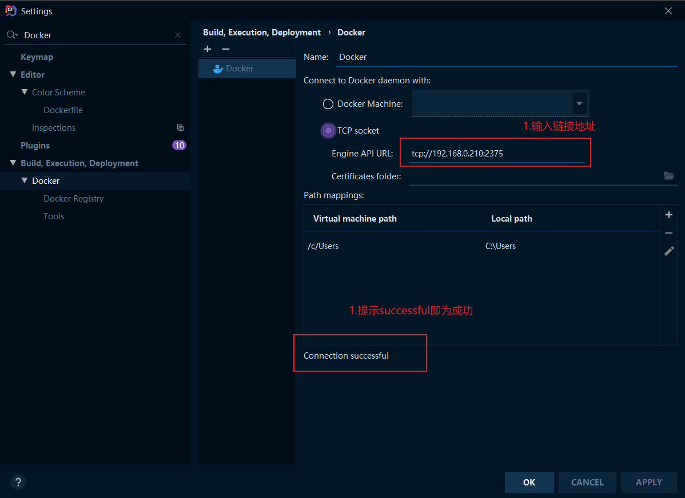
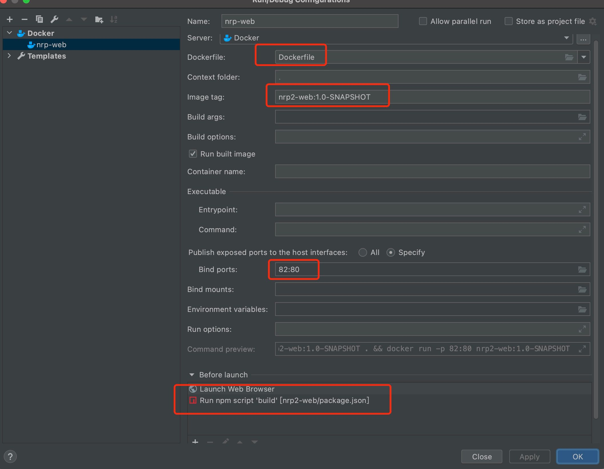

#项目初始化

## 开发环境发布说明
- IDEA按照如图所示配置对Docker的连接
    ```
    目标地址：tcp://192.168.1.50:2375
    ```
    
- 配置DockerFile
    
- 部署验证

## 目录结构

- Dist：webpack打包后的报告.html
- Doc：文档文件夹
- Images：docker文档图片文件夹
- Public：公共文件夹，excel文件/icon等
- Src：代码文件夹
  - assets:存放静态资源文件夹
  - components：公共组件文件夹
  - config：配置文件
  - core：核心功能
  - layout：菜单组件
  - mock：前端模拟数据
  - page：界面文件夹
  - store：统一管理的状态文件夹
  - style：公共样式
  - template：模版文件
  - utils：工具方法文件夹
  - App.tsx 路由根文件
  - index.tsx 入口文件
  - setupProxy:代理配置文件

## 工作流
- 依赖
yarn add bpmn-js
yarn add bpmn-js-properties-panel
