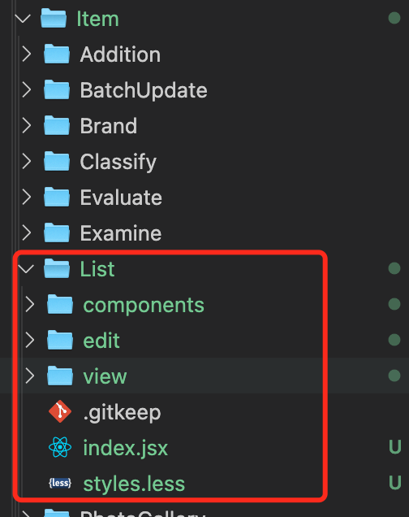

# 文件结构搭建规则

示例：
Item
├── /List # 商品列表
│ ├── /components/ # 商品列表领域下 查询、新增/编辑、详情页面公共业务组件
│ ├── /edit/ # 新增/编辑
│ │ └── /components/ # 通常可以不建，新增/编辑页面有独有的业务组件时建
│ ├── /view/ # 详情
│ ├── index.tsx # 主页面（查询、列表）
│ ├── styles.less # 页面有特殊样式时新建
│ ├── service.ts # 页面使用的接口



# 路由规则

新增 编辑 预览 三种状态页面分别使用两个路由、两套 component。

1. 新增编辑指向同一个 component。判断是新增的话表单就是空的，编辑的话，就拉数据；
2. 预览指向另一个 component，用来做展示

举个例子：
比如商品列表
/item/list/:type
type 是动态的

/item/list/index
/item/list/detail/create 就是新增
/item/list/detail/123 就是编辑，123 时用户的 id
/item/list/view/123 就是预览，预览商品 123 的数据

```js
 {
   // 一级菜单
    path: '/item',
    name: 'item',
    meta: { title: '商品' },
    // 二级菜单
    routes: [
      {
        path: '/item/list',
        name: 'itemList',
        meta: { title: '商品列表' },
        // 三级菜单
        routes: [
          {
            path: '/item/list/index',
            name: 'itemListIndex',
            meta: { title: '商品列表' },
            component: React.lazy(() => import('@/page/Item/List'))
          },
          {
            path: '/item/list/detail/:type',
            name: 'itemListCreateOrEdit',
            meta: { title: '商品新增/编辑' },
            component: React.lazy(() => import('@/page/Item/edit'))
          },
          {
            path: '/item/list/view/:id',
            name: 'itemListView',
            meta: { title: '商品详情' },
            component: React.lazy(() => import('@/page/Item/view'))
          }
        ]
      }
    ]
  }
]
```
